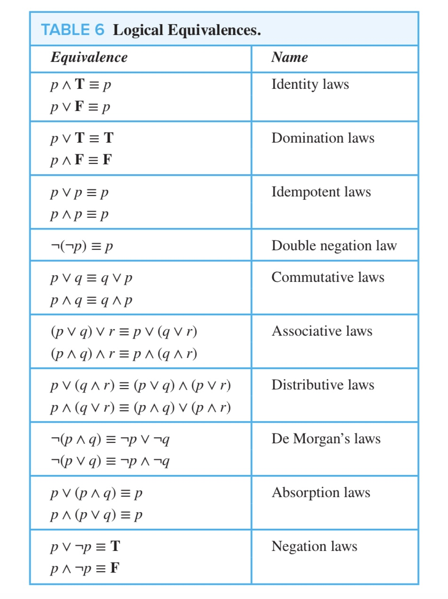
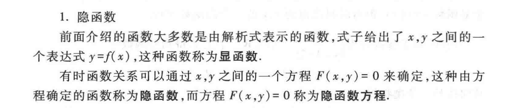
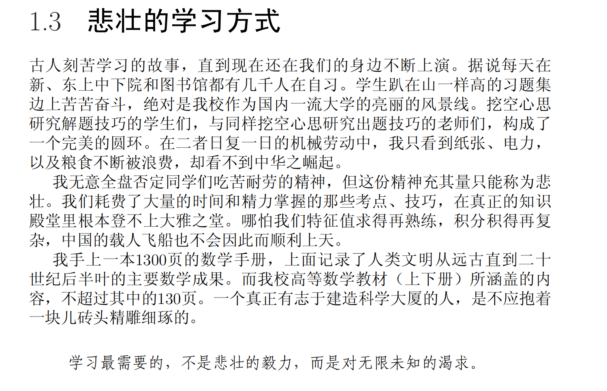

# GEMA1001 Week 2 Tutorial

HuNianlan

---

## Contents

### Review
- 数与函数
- 逻辑符号与命题逻辑
- 映射与函数
- 初等函数，函数的趣例
- 隐函数，函数的参数表达
- 极坐标与极坐标下的曲线描述

---

## Contents

### Howework

### How to write a proof

---

## Contents

### Some Useful tools/webs
- 文档排版
- 数学软件
- 翻译
- 交流讨论以及资料获取
- 项目合作以及版本管理

---

## Contents

### Extension
<!-- - 数与函数
  - Dedekind cuts
  - cardinality and Continuum hypothesis (Naive Set Theory) -->
- 逻辑符号与命题逻辑
  - Fault Tree Analysis(SE)
  - 专家系统(AI)
- 映射与函数

<!-- --- -->
<!-- 
### Some tips for math learning
我们为什么要相信一个人类司机？ -->

---

# Review

---

## 数与函数：自然数$\rightarrow$整数$\rightarrow$有理数$\rightarrow$ 实数 $\rightarrow$ 复数
### Definition
[自然数集(natural number)](../../slides/week1/一元微积分_第一讲__映射_函数_命题逻辑.pdf) : $\mathbb{N}:=\{0,1,2,\cdots\}$；
[非零自然数集(nonzero natural number)](../../slides/week1/一元微积分_第一讲__映射_函数_命题逻辑.pdf) : $\mathbb{N}_{+}=\{1,2,\cdots\}$
[整数集(integer)](../../slides/week1/一元微积分_第一讲__映射_函数_命题逻辑.pdf) : $\mathbb{Z}:=\{\cdots,-2,-1,0,1,2,\cdots\}$
[有理数集(rational number)](../../slides/week1/一元微积分_第一讲__映射_函数_命题逻辑.pdf) : $\mathbb{Q}:=\left\{\frac{p}{q}\mid p,q\in \mathbb{Z}\,\textit{且}\,q\neq 0;\,\,p,q\,\textit{互素，即没有共同因子}\right\}$
[无理数(irrational number)](../../slides/week1/一元微积分_第一讲__映射_函数_命题逻辑.pdf) : 数轴上除却有理数所对应的点之外的点所对应的数
[实数(real number)](../../books/大学数学微积分%20上册%20第2版.pdf) : 有理数和无理数的并集
(https://math.stackexchange.com/questions/261074/true-definition-of-the-real-numbers)
[复数(complex number)](../../slides/week1/一元微积分_第一讲__映射_函数_命题逻辑.pdf) : $\mathbb{C}:=\{a+bi\mid a,b\in\mathbb{R};\,i^{2}=-1\}$

---

## 数与函数：自然数$\rightarrow$整数$\rightarrow$有理数$\rightarrow$ 实数 $\rightarrow$ 复数
### Theory
***实数系的连续性定理*** ： 实数轴上的点与实数的全体有个一一对应.

给定任意小的正实数$\delta>0$，实数轴上任意长度为$\delta$的区间内，总有无穷多个有理数.

---

## 逻辑符号与命题逻辑

### Definition

1. 或(or) : $\lor$

2. 且(and) : $\land$

3. 否(there is no) : $\neg$
   
4. 至少存在(there exists at least one) : $\exists$

5. 存在唯一(there exists one and only one) : $\exists!$

6. 对所有的(for all) : $\forall$
   
7. 蕴含、推出(implies) : $\Rightarrow$

定义 2.1 : 如果对两命题$p,q$，有$p\Rightarrow q$ 且 $q\Rightarrow p$，则称$p$和$q$等价（equivalent），或$p$当且仅当（if and only if, iff），记为$p\Longleftrightarrow q$.

---

## 逻辑符号与命题逻辑
### Theory

命题 2.2 : 关于命题的否定形式，我们有以下结论

$\neg(\neg p)\Longleftrightarrow p$. （双重否定）
$\left\{\begin{array}{c}
          \neg (p\lor q)\quad \Longleftrightarrow \quad \neg p\land \neg q \\
          \neg(p\land q)\quad \Longleftrightarrow \quad \neg p\lor \neg q
    \end{array}\right.$ （对偶律，或德摩根律）

命题 2.3: 对涉及全称量词$\forall$ 和存在量词 $\exists$ 的命题，其否定形式为（更一般的对偶律）
$$\left\{\begin{array}{c}
        \neg(\forall x,\,\textit{使得}\,p(x))\quad \Longleftrightarrow\quad 
    \exists\,x,\,\textit{使得}\,\neg\,p(x)  \\
     \neg(\exists x,\,\textit{使得}\,p(x))\quad \Longleftrightarrow\quad 
    \forall\,x,\,\textit{使得}\,\neg\,p(x)
    \end{array}\right.$$
其中$p(x)$是涉及$x$的命题.

---

## 逻辑符号与命题逻辑

---

## 逻辑符号与命题逻辑
### Theory
对偶原则(duality principle) : 对命题 $Q_{1}p_{1}Q_{2}p_{2}\cdots Q_{n}p_{n},\,\textit{使得}\,p_{n+1}$ （其中$Q_{i}$为$\forall$或$\exists$,\,$p_{i}$\,为命题），其否定命题：
将诸$Q_{i}$中的$\forall (\exists)$改成$\exists (\forall)$，并将最后的$p_{n+1}$改成其否定形式.

---

## 映射与函数
### Definition
周期函数（periodic function）: 一个函数$f(x)$ 称为是周期函数（periodic function）如

$\exists\, T>0$，$\forall\,x\in D(f)$，成立$f(x+T)=f(x)$

满足上命题的最小$T$，称为$f$的最小正周期. 

则$f$是非周期函数应描述如下

$\forall\,T>0,\,\exists\,x\in D(f)$，
使得$f(x+T)\neq f(x)$

---

## 映射与函数
### Definition

定义 3.1：设$X, Y$ 为两非空集合，若$T$是一个从$X$的元素到$Y$的元素的一个对应法则，它满足：对任意$x\in X$，存在唯一的$y\in Y$与之对应，则称$T$ 是从$X$到$Y$的映射（mapping），记为$T: X\longrightarrow Y\quad x\longmapsto y=T(x)$. 另称$y=T(x)$是$x$在$T$作用下的象（image），$x$是$y$在$T$下的一个原象（preimage）. 此时，$X$称为$T$的定义域，且$T$的象（或值域）$R(T)$定义为 $R(T):=\{y\in Y\mid y=T(x), \,x\in X\}$.

---

## 映射与函数
### Definition
定义 3.3 ：一映射$T:\,X\longrightarrow Y$ 称为是单射（injection） 如它满足性质：
$\forall\,x,y\in X$，如$T(x)=T(y)$，则必有$x=y$.

即不存在两不同的元素被映为同一元素. 单射也被称作是“一一映射”（one-to-one mapping）. 

定义 3.4： 一映射$T:\,X\longrightarrow Y$ 称为是满射（surjection） 如它满足性质：
$\forall\,y\in Y$,$\exists\,x\in X$，使得$y=T(x)$. 
即$Y$中的任意元素都是$T$的象. 满射也被称作是映上的（onto）.

定义 3.5： $T:\,X\longrightarrow Y$ 称为是双射（bijection） 如它既是单射又是满射. 我们也常说一个双射$T:X\longrightarrow Y$建立了集合$X$和集合$Y$之间的一个一一对应（one-to-one correspondence）.

---

## 映射与函数
### Definition
线性映射 ：一个映射$T:\,\mathbb{R}\longrightarrow \mathbb{R}$称为是线性的（linear） 如果
1. $T(x+y)=T(x)+T(y),\,\,\forall x,y\in\mathbb{R}$;
2. $T(kx)=kT(x),\,\,\forall k\in \mathbb{R}$

定义 3.6： 设$T:\,X\longrightarrow Y$ 是映射，则对其象$R(T)$中的任意元素$y$，如果其原象$x\in X$（即满足$T(x)=y$的$x$）是唯一确定的，则由映射的定义知下面对应规则定义了一映射
$$S: R(T)\longrightarrow X\qquad y\longmapsto x\,\,(T(x)=y)$$

映射$S$称为$T$的逆映射（inverse mapping），常记作$T^{-1}$. $T^{-1}$的定义（值）域是$T$的值（定义）域. 

若将$T$特殊化为一元实函数，则其逆便是我们熟知的反函数的概念. 一函数和它的反函数的图像关于直线$y=x$对称. 

---

## 映射与函数
### Definition
定义 3.7： 设$f: U\longrightarrow Y$和$g: X\longrightarrow V$是两映射，如果$R(g)\cap D(f)\neq \emptyset$，则可定义$f$与$g$的复合映射（composite map）如

$$f\circ g:\,X^{*}\longrightarrow Y\qquad (f\circ g)(x):=f[g(x)],\,x\in X^{*}$$

其中$X^{*}=D(f\circ g):=\{x\in X\mid g(x)\in D(f)\}\subseteq X$. 

---

## 初等函数，函数的趣例
### Definition
下面五类函数称为基本初等函数（basic elementary functions）
1. 幂函数：$y=x^{a}\,(a\in \mathbb{R})$. 常数函数$y=c$看成是其特例. 
2. 指数函数：$y=a^{x}\,(a>0,\,a\neq 1)$.
3. 对数函数：$y=\log_{a}\,x\,(a>0,\,a\neq 1)$. 当$a=e=2.71828\cdots$时，记为$y=\ln{x}$.
4. 三角函数：$y=\sin{x}$,\,$y=\cos{x}$,\,$y=\tan\,x$ 等.
5. 反三角函数：$y=\arcsin{x}$,\,$y=\arccos{x}$,\,$y=\arctan\,x$ 等.

定义 4.1： 由基本初等函数经过有限次四则运算与复合运算所产生的函数称为初等函数. 

---

## 初等函数，函数的趣例
### Example
- 有理函数（rational function）定义为两多项式函数之商，即具有如下形式的函数$$y=\frac{a_{0}+a_{1}x+a_{2}x^{2}+\cdots+a_{n}x^{n}}{b_{0}+b_{1}x+b_{2}x^{2}+\cdots+b_{m}x^{m}}$$
其自然定义域是所有使得分母不为零的实数. 

- 分段表述的初等函数：
 $y=|x|=\left\{\begin{array}{c}
     x\qquad x\geq 0  \\
     -x\qquad x<0
\end{array}\right.$  它可表达为$y=|x|=\sqrt{x^{2}}$

- 非初等的分段函数：
符号函数（sign function）：$sgn\,x:=\left\{\begin{array}{c}
     1 \qquad x>0 \\
     0\qquad x=0\\
     -1\qquad x<0
\end{array}\right.$ 

---

## 初等函数，函数的趣例
### Example

- $\delta$ 函数(脉冲函数)：$\delta\,(x)=\left\{\begin{array}{c}
     \infty\quad x=0  \\
     0\quad x\neq 0
\end{array}\right.$
  - 它的图像与$x$轴所围“面积”为1. 
  - 在信号处中非常常见，常用于对信号进行采样 
  - 对其严格处理须用到数学中的“广义函数”，或“分布”（distribution）理论. 
    - $\int _{-\infty }^{\infty }f(x)\,\delta (x)\,dx=f(0)$
  - 形式上，$\delta\,(x)$可看成是$sign\,x$的导函数.

- 取整函数：$y=[x]=n,\,n\leq x<n+1,\,n\in\mathbb{Z}$. 即$[x]$是不超过$x$的最大整数. 

- 非负小数部分函数：$y=(x)=x-[x]$.

---

## 初等函数，函数的趣例
### Example
-  迪利克雷（Dirichlet）函数: $D(x):=\left\{\begin{array}{c}
     1\qquad x\in \mathbb{Q}  \\
     0\qquad x\notin \mathbb{Q}
\end{array}\right.$

---

## 初等函数，函数的趣例
### Example

- 双曲函数（hyperbolic function）是一类常用的初等函数，其基本类型为

    - 双曲正弦函数： $\displaystyle \sinh{x}:=\frac{e^{x}-e^{-x}}{2}$
    - 双曲余弦函数： $\displaystyle \cosh{x}:=\frac{e^{x}+e^{-x}}{2}$
    - 双曲正切函数： $\displaystyle \tanh{x}:=\frac{e^{x}-e^{-x}}{e^{x}+e^{-x}}$
    - 双曲余切函数： $\displaystyle \coth{x}:=\frac{e^{x}+e^{-x}}{e^{x}-e^{-x}}$

---

## 初等函数，函数的趣例

### Property of hyperbolic function
$\displaystyle\tanh{x}=\frac{\sinh{x}}{\cosh{x}}$;
$\cosh^{2}{x}-\sinh^{2}{x}=1$;
$\displaystyle\sinh{(x\pm y)}=\sinh{x}\cosh{x}\pm \cosh{x}\sinh{y};$
$\displaystyle\cosh{(x\pm y)}=\cosh{x}\cosh{y}\pm \sinh{x}\sinh{y}$.

---

## 隐函数，函数的参数表达
### Definition
- implicit function

  - 显式$y=f(x)$函数可看做是由方程$F(x,y)=y-f(x)$界定的函数. 

---

## 隐函数，函数的参数表达
### Definition
- 设函数由方程$F(x,y)=0$ 给出，若存在一个参数（parameter） $t$，使得函数关系可描述为如下方程
$$\left\{\begin{array}{c}
     x=x(t)  \\
     y=t(t)
\end{array}\right.\qquad t\in I\subseteq \mathbb{R}$$
则称它是函数的参数方程（parametric equation）表示. 其中参数$t$的取值范围（区间）$I$由原函数的定义域决定. 

---

## 极坐标与极坐标下的曲线描述
### Definition
平面上点$P$的位置除用笛卡尔坐标$(x,y)$表示外，还可用极坐标（polar coordinate）}$(r,\theta)$来表示. 极坐标与笛卡尔坐标之间的转换关系为
$$\left\{\begin{array}{c}
     x=r\cos{\theta} \\
     y=r\sin{\theta}
\end{array}\right.\qquad \Longleftrightarrow\qquad\left\{\begin{array}{c}
     r=\sqrt{x^{2}+y^{2}}  \\
     \theta=\arctan\frac{y}{x}\quad \textit{第一象限内}
\end{array}\right.$$

---

# Homework

---

### [How to complete a proof](../../books/HOW%20TO%20PROVE%20IT.pdf)
- 形式上
  - 请减少使用 $\because$ 和 $\therefore$
    - 密集恐惧症患者深表感谢!
  - 如果时间充足，请写出推导过程中运用的定义和定理
    - 助教脑子不太好，有些意识流的证明可能会get不到
  - 注意换行和分段，大证明可以先写出要证明的引理和整体证明逻辑然后再对引理进行证明
  - (注意用词的区别)：
    - for all & for arbitrary
    - hence & thus & therefore

- 思维上
  - 要“懒”一点，如果实在证不出来可以试着换个思路，比如用反证法，或者去证明逆否命题等等
  - 不要用强定理去证弱定理，**这简直‌倒反天罡！！！**
  - 初始阶段可以试着从定义出发去进行证明
    - 当然，考试来不及了请直接 `by theory`

- 可以多看书上证明等例子，然后学着写。
- 即使证出来，也可以多想想能不能证明的更优雅一点。

---
# 希望大家最后都可以写出正确、完整、连贯、简洁、优雅的证明

---

---

## Some Useful tools/webs
### 文档排版
- [Latex](../../books/一份不太简短的LATEX%202e介绍.pdf)
- markdown
- lyx

---

## Some Useful tools/webs
### 数学软件
- wolform/mathematica/matlab
- geogebra

### 交流讨论以及资料获取
- zlib
- stackexchange/wiki
- bilibili(online classes)
  - **b站大学yyds！！！**

---

## Some Useful tools/webs
### 翻译
- deepl

### 项目合作以及版本管理
- github (for cs students)

---

<!-- ## Extension
### 数与函数
  - Dedekind cuts
  - Cardinality and Continuum hypothesis (Naive Set Theory) -->

---
## Extension
- 逻辑符号与命题逻辑
  - Fault tree analysis (FTA)
  - Expert systems (AI) 1988 - 93

---

## Extension
### 映射与函数
  - https://textbooks.math.gatech.edu/ila/matrix-transformations.html

