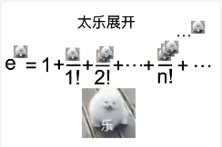

# GEMA1001 Week 3 Tutorial

HuNianlan

---

## Contents

### Review
- 上（下）确界
- 数列及其单调性、有界性
- 数列的极限
- 极限证明技巧举例
- 数列极限的性质及运算法则
- 单调有界数列极限存在准则
- 区间套定理与凝聚定理
- 极限计算举例
  
---
## Contents
### Extensions
- 实数的完备性、$Q$中“空隙”存在之证明
- 可数与不可数
  
---
## 目前习题课的安排：
18.00 - 19.00: 习题讲解，如果有剩余时间讲latex运用或者其他数学软件（暂定）
19.00 - 19.15: 答疑时间请找潘彦助教
19.15 - 19.40: 拓展些别的或者放点小视频

如果有quiz
18.10 开考
大多数人写完基础题先把基础题讲了

请根据需求合理选择上课时间（允许时间为`None`）

---

## 关于作业提交
你们需要：
- 上传文档为pdf格式电子版
- 文件名为“学号_姓名”
- 清晰可见

建议：
- 按照题号顺序答题
- 作业如果要放题目上去，答题部分不要覆盖在题目上
- 写完一道题换一页写，或题目之间留间隙
- 最好上传纵向的作业（为了ta们的脖子）

----

## 关于quiz

***最终quiz分数大家都会给满，所以如果有什么我们做的不到位的请少骂（疯狂叠甲）***
每章结束quiz(第一次大约 10.24左右)
重在参与和查缺补漏
可能会有一些新题型：
- 无论看到什么请不要惊讶
- 也不要直接开骂
- 我们并不是以为难学生为目的去出的题

if you are busy, just quit it!
- **This won't affect your scores ! ! !**

----
## 关于证明

最近一次的作业证明规范显著提升

但还是有几个点要提一下：
请不要中英文混着写！！！
- 日后用latex写证明你会被环境搞疯
- **更不要拼音英文混着写！！！！**
    - 著名作品有你们信导ta lcf同学的`random bianliang`!

---
## 关于latex
- 模版在`material`里面
- `mathpix` 手写转latex，前提是如果ta肉眼很难识别，它也可能会寄
  - 有免费额度，后面要交钱
  - 不过如果一下子latex不好上手的或者习惯用word的可以先试试 `lyx`
----
## 云录播平台
egate 搜索云录播平台

----
## 关于latex
自学或者我课上讲？

----
