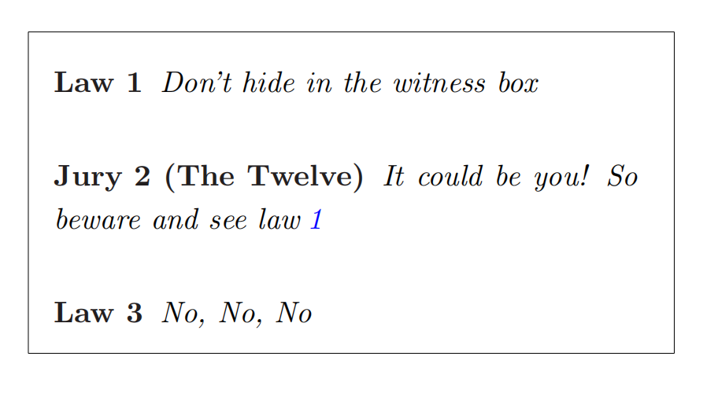
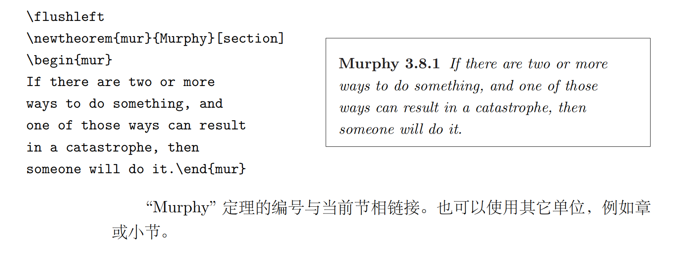

# Latex Tutorial 1 数学公式

HuNianlan

---
- 基本知识
- 数学模式中的分组
- 垂直对齐
- *幻影
- 数学字体的大小
- 定义、定理...
- 粗体符号
- 数学符号表

---
## 关于配环境可以参考
https://zhuanlan.zhihu.com/p/166523064

---
markdown可以直接参照vscode官网
https://code.visualstudio.com/Docs/languages/markdown


---
## 基本知识
### 段落间的数学公式
- $\sum_{i = 1}^{n}$
```latex
1. \(\sum_{i = 1}^{n}\) % recommended
2. $\sum_{i = 1}^{n}$
3. 
\begin{math}
\sum_{i = 1}^{n}
\end{math}
```
---

### 较大的数学式子
- 
    $$\sum_{i = 1}^{n}$$
```latex
1. \[\sum_{i = 1}^{n}\] % recommended
2. $$\sum_{i = 1}^{n}$$
3. 
\begin{displaymath}
\sum_{i = 1}^{n}
\end{displaymath}
% no (1),(2),\dots
4.
\begin{equation}
\sum_{i = 1}^{n}
\end{equation}
```
---
### 数学模式的“特点”
#### 在数学模式中：
- 空格和分行都将被忽略
  - ` \, \quad , \qquad, ~`
- 不允许有空行，每个公式中只能有一个段落
- 每个字符都将被看作是一个变量名并以此来排版。如果你希望在公式
中出现普通的文本（使用正体字并可以有空格），那么你必须使用命
令 `\textrm{...}` 来输入这些文本 

---
- `\mathbb`
数学家们通常对使用什么样的符号非常挑剔：习惯上使用 **“空心粗体”**（blackboard bold）来表示实数集合。这种字体可用 amsfonts 或
amssymb 宏包中的命令 `\mathbb` 来得到。
- $\mathbb{R}$
- $\mathbb{N}$

---
## 数学模式中的分组
***数学模式中的命令仅对其后面第一个字符起作用。*** 所以，如果你
希望某一命令作用于多个字符的话，那么你就必须将它们放置于括号
中：`{...}`。
different between `\sum_i = 1` and `\sum_{i = 1}`
- $\sum_i = 1$
- $\sum_{i = 1}$ this is what we want ! ! !

<!-- note: 注意编译器括号配对问题 -->


---
 
## 垂直对齐
- `&` : 竖直对齐
- `\\` : 换行
- `\hline` : 横线
---

Example:

- 
    $$
    \mathbf{X} =
    \left( \begin{array}{ccc}
    x_{11} & x_{12} & \ldots \\
    x_{21} & x_{22} & \ldots \\
    \vdots & \vdots & \ddots
    \end{array} \right)
    $$

```latex
\begin{displaymath}
\mathbf{X} =
\left( \begin{array}{ccc}
x_{11} & x_{12} & \ldots \\
x_{21} & x_{22} & \ldots \\
\vdots & \vdots & \ddots
\end{array} \right)
\end{displaymath}
```

---

- 
$$
\begin{align*}
H(X) =& -\sum_{n = 1}^\infty \frac{1}{2^n} \log \frac{1}{2^n}\\ =& \sum_{n = 1}^\infty n\frac{1}{2^n} \\
=& \sum_{n = 0}^\infty n\frac{1}{2^n} \\
=& \frac{1/2}{(1-1/2)^2} \\
=& 2
\end{align*}
$$

```latex
\begin{align*}
H(X) =& -\sum_{n = 1}^\infty \frac{1}{2^n} \log \frac{1}{2^n}\\ =& \sum_{n = 1}^\infty n\frac{1}{2^n} \\
=& \sum_{n = 0}^\infty n\frac{1}{2^n} \\
=& \frac{1/2}{(1-1/2)^2} \\
=& 2
\end{align*}
```
---
## *幻影
$$
{}^{12}_{\phantom{1}6}\textrm{C}
\qquad \textrm{versus} \qquad
{}^{12}_{6}\textrm{C}
$$

```latex
\begin{displaymath}
{}^{12}_{\phantom{1}6}\textrm{C}
\qquad \textrm{versus} \qquad
{}^{12}_{6}\textrm{C}
\end{displaymath}
```
---
## 数学字体的大小
在数学模式中，字体大小用四个命令来设定：
`\displaystyle`, `\textstyle`, `\scriptstyle` and `\scriptscriptstyle`
- $\displaystyle (123)$
- $\textstyle (123)$ 
- $\scriptstyle (123)$
- $\scriptscriptstyle (123)$

***改变式样也会影响上下界显示的方式,所以不要忘了做相应调整，比如括号的大小...***

---
$$
\mathop{\mathrm{corr}}(X,Y)=
\frac{\displaystyle
\sum_{i=1}^n(x_i-\overline x)
(y_i-\overline y)}
{\displaystyle\biggl[
\sum_{i=1}^n(x_i-\overline x)^2
\sum_{i=1}^n(y_i-\overline y)^2
\biggr]^{1/2}}
$$
```latex
\begin{displaymath}
\mathop{\mathrm{corr}}(X,Y)=
\frac{\displaystyle
\sum_{i=1}^n(x_i-\overline x)
(y_i-\overline y)}
{\displaystyle\biggl[
\sum_{i=1}^n(x_i-\overline x)^2
\sum_{i=1}^n(y_i-\overline y)^2
\biggr]^{1/2}}
\end{displaymath}
```
---
## 定理、定义 . . .
`\newtheorem{name}[counter]{text}[section]`
- name 是短关键字，用于标识“定理”
- text 定义“定理”的真实名称，会在最终文件中打印出来。
- 方括号中的选项是任意的，可以用于指定“定理”中使用的标号。
- counter 可以指定先前声明的“定理”的 name。然后新“定理”会
按同样的顺序编号。
- section 指定“定理”编号所在的章节层次。

---


---

```latex
% definitions for the document
% preamble
\newtheorem{law}{Law}
\newtheorem{jury}[law]{Jury}
%in the document
\begin{law} \label{law:box}
Don’t hide in the witness box
\end{law}
\begin{jury}[The Twelve]
It could be you! So beware and
see law~\ref{law:box}\end{jury}
\begin{law}No, No, No\end{law}
```
“Jury” 定理和 “Law” 定理使用同一个计数器。因此，编号是顺序排列
的。方括号中的选项用于为这个定理指定一个标题或者类似的东西。

---


---
## 粗体符号
- 数学环境内：
  - `\mathbf` ：没有斜体
  - `\boldsymbol` ：保留斜体
- 数学环境外
   - `boldmath`

$$
\mu, M \qquad \mathbf{M} \qquad
\boldsymbol{\mu}, \boldsymbol{M}
$$


```latex
\begin{displaymath}
\mu, M \qquad \mathbf{M} \qquad
\boldsymbol{\mu}, \boldsymbol{M}
\end{displaymath}
```

---
数学符号表
[p50页](../../books/一份不太简短的LATEX%202e介绍.pdf)

---

amsthm 提供的 proof 环境

---
helpful tool
https://editor.codecogs.com